# abb_wrapper
These packages are intended to ease the interaction between ABB OmniCore controllers and ROS-based systems, by providing ready-to-run ROS nodes.

## Important Notes
Tested on Ubuntu 18.04 with ROS Melodic.

## Overview

These packages are intended to ease the interaction between ABB OmniCore controllers and ROS-based systems, by providing ready-to-run ROS nodes.

The included (*principal*) packages are briefly described in the following table:

| Package | Description |
| --- | --- |
| [abb_librws](abb_librws) | (A modified version of https://github.com/ros-industrial/abb_librws) Provides a ROS node that communicate with the controller using Robot Web Services 2.0  |
| [abb_libegm](abb_libegm) | (A modified version of https://github.com/ros-industrial/abb_libegm) Provides a ROS node that exposes hardware interface, for *direct motion control* of ABB robots (via the *Externally Guided Motion* (`EGM`) interface). |
| [abb_driver](abb_driver) | Provides ROS nodes for the main interface with the controller. It combine the RWS and EGM node and use the parameters in the yaml file. |
| [abb_controllers](abb_controllers) | Provides ROS nodes for kinematic calculation using the URDF model of the robot. |
| [gofa_description](gofa_description) | Provides ROS nodes for kinematic calculation using the URDF model of the robot. |
| [yumi_description](yumi_description) | Provides ROS nodes for kinematic calculation using the URDF model of the robot. |
| [degub_rviz_tool](abb_description) | Tools used for tests and debug |

Please see each package for more details (*e.g. additional requirements, limitations and troubleshooting*).

## Build Instructions

It is assumed that [ROS Melodic has been installed](http://wiki.ros.org/melodic/Installation/Ubuntu) on the system in question.

### Set up ROS

The following instructions assume that a [Catkin workspace](http://wiki.ros.org/catkin/Tutorials/create_a_workspace) has been created at `$HOME/catkin_ws` and that the *source space* is at `$HOME/catkin_ws/src`. Update paths appropriately if they are different on the build machine.

The following instructions should build the main branches of all required repositories on a ROS Melodic system:

```bash
echo "source /opt/ros/melodic/setup.bash" >> ~/.bashrc

mkdir -p ~/catkin_ws/src
cd ~/catkin_ws/
catkin_make

echo "source ~/catkin_ws/devel/setup.bash" >> ~/.bashrc
```

If no errors were reported as part of the `catkin_make` command, the build has succeeded and the driver should now be usable.

### Install POCO

Start a terminal session (launch terminal) by <kbd>Ctrl</kbd> + <kbd>Alt</kbd> + <kbd>T</kbd>

Install essential dependencies and git, execute the following commands one by one:

```bash
sudo apt update
sudo apt upgrade
sudo apt install build-essential gdb cmake git
sudo apt-get install openssl libssl-dev
sudo apt-get install libiodbc2 libiodbc2-dev
sudo apt-get install libmysqlclient-dev
```

Get root access:
```bash
sudo -i
```

Navigate to /tmp/ directory (or any other directory to store temporary files).
```bash
cd /tmp/
```

Clone the Poco git repo:
```bash
git clone -b master https://github.com/pocoproject/poco.git
```

Compile the libraries:
```bash
cd poco
mkdir cmake-build
cd cmake-build
cmake ..
cmake --build . --config Release
```

**Note**: If you get a library not found error, just install that library via apt.

Install the libraries to include in C++ code:
```bash
sudo cmake --build . --target install
```

Copy all the poco file from /usr/local/lib/ to /usr/lib

### Install Boost C++

[Boost C++](https://www.boost.org)
```bash
sudo apt-get install libboost-all-dev

```

### Set up the interface

Copy **abb_wrapper** folder to **src** folder on catkin workspace (`~/catkin_ws/src`).
```bash
cd catkin_ws/src
git clone https://github.com/JOiiNT-LAB/abb_wrapper
```

Move back to the workspace folder (catkin_ws/)
```bash
cd ..
```

Compile the workspace
```bash
catkin_make
```

If there are no errors you are ready to proceed to set up the robot.

## Robot Set up

### Requirements

* RobotWare version `7.2` or higher (lower versions are incompatible due to changes in the EGM communication protocol).
* A license for the RobotWare option *Externally Guided Motion* (`3124-1`).
* StateMachine 2.0 RobotWare Add-In (soon on the RobotApps)


After the creation of the system just configure robot to accept external communication both for EGM and Web Services.
### RobotStudio

Open RobotStudio

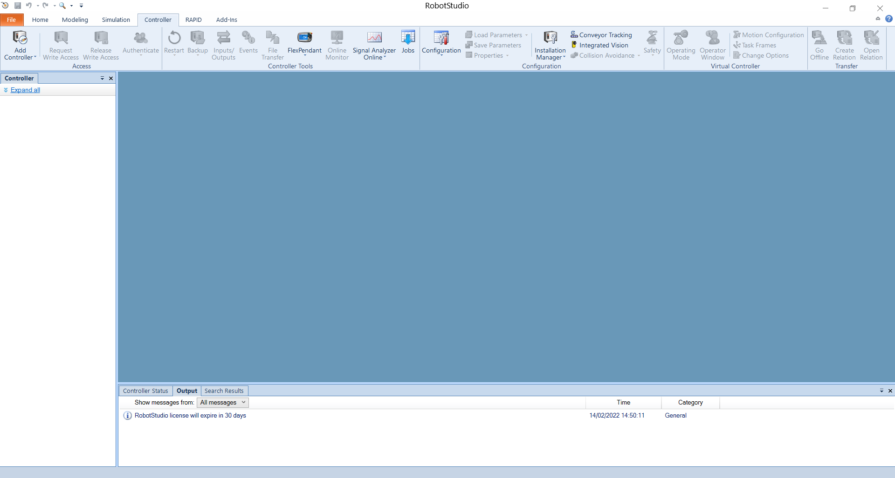

On the Controller Tab, click Add Controller > One Click Connect..

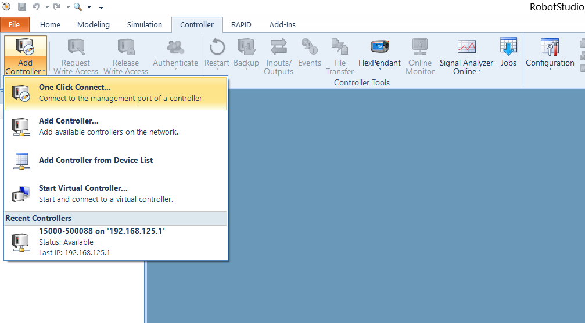

Click on "Log in as Default User" button

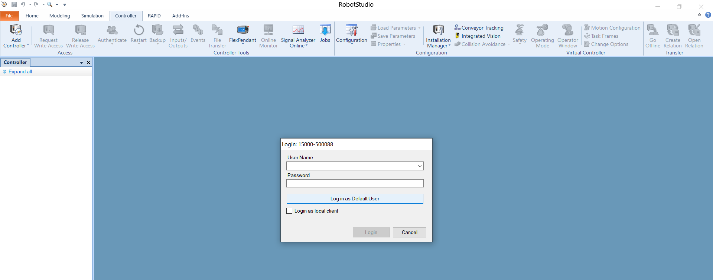


### Setup the IP address for the WAN port
With this configuration, we will set up the IP address of the WAN port where the computer running ROS will be connected.

* On the Controller tab, in the Configuration group, click Properties and then click `Network settings`.
  The Network settings dialog opens.
  
  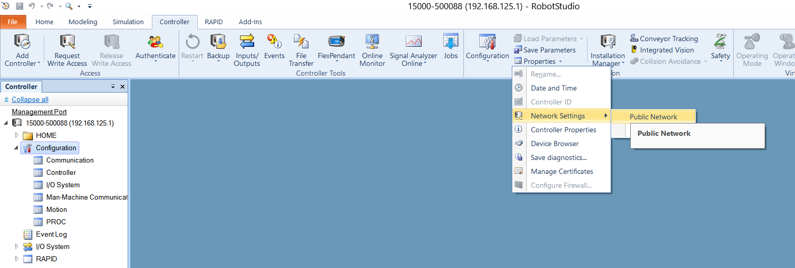

* Select `Use the following IP address` and then enter the required IP address and Subnet mask boxes to manually set the IP address of the controller


  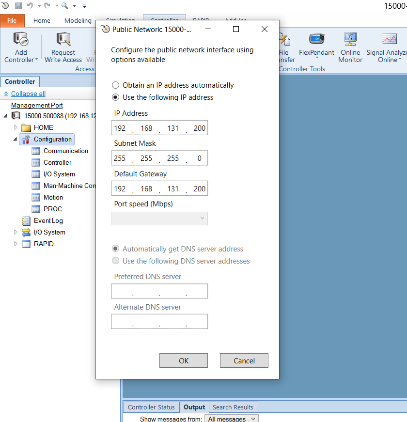

**This step is optional, also the MGMT port can be used.**

The MGMT port have a fixed IP address (*192.168.125.1* ) and a DHCP server.

If you are using the MGMT port make sure that the connected computer running ROS is on the same natwork (*192.168.125.xx* ) or the DHCP is enabled.

### Setup the UDP device
Configure the IP address and the port to use for the UDP protocol. **This IP address must be the same of the PC running ROS.**

Using RobotStudio, first **request the write access**.

  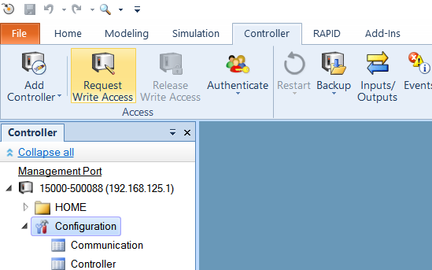

On the Controller tab, in the Configuration group, click Configuration and then click `Communication`.

  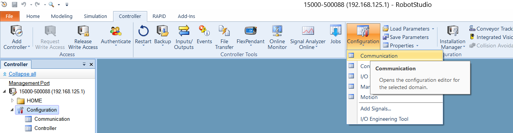

Double click on the `UDP Unicast Device` item.

  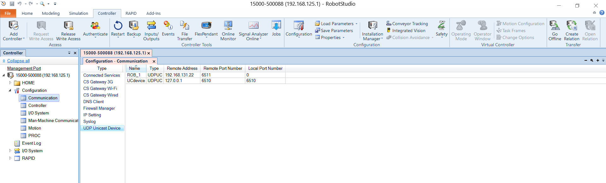


### Setup the Controller Firewall
Using the WAN port the firewall on the public network must be configured.

Using RobotStudio, first **request the write access**.
On the Controller tab, in the Configuration group, click Configuration and then click `Communication`.

Double click on the `Firewall Manager` item.
Enable on the public network the following services:
* RobotWebServices
* UDPUC (available from RW 7.3.2)

  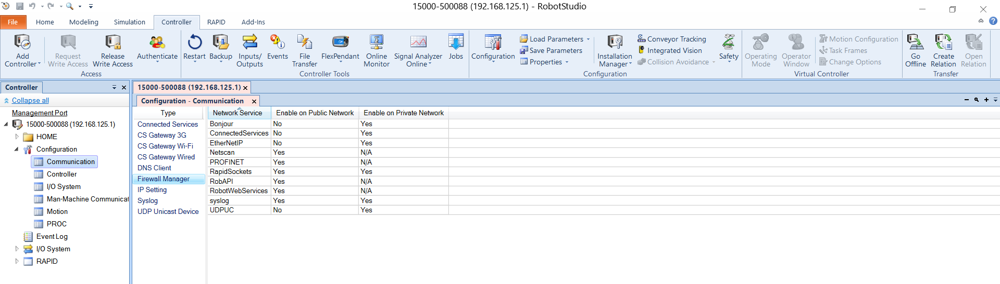

### Configure the user privileges
This package use the [Robot Web Services 2.0](https://developercenter.robotstudio.com/api/RWS) (RWS) to control the robot.
Each RWS session is logged using a user that must to be present on the User Authorization System of the controller (for more details about User Authorization System, see Operating manual - RobotStudio).
If not specified, for the RWS communication, the default user is used:
* Username: **Default User**
* Password: **robotics**

By default, the **Default User** does not have the grant *Remote Start and Stop in Auto* (run rapid routine from the WAN port in Auto mode).

The steps to configure the user account are:
1. Using RobotStudio log-in on the controller as Administrator (usually with the user **Admin** and password **robotics**).
  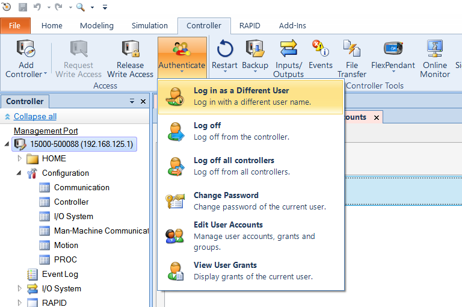
  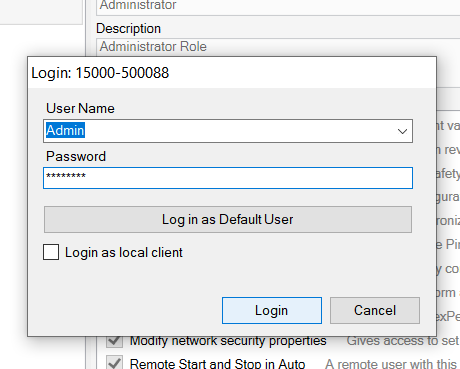

2. On the Controller tab, in the Access group, click Authenticate and then click `Edit User Account`.
   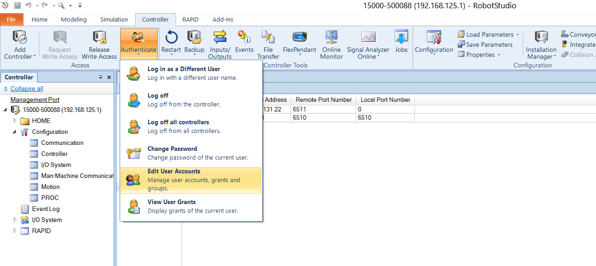

3. On the tab roles check if the grant *Remote Start and Stop in Auto* is checked for the role of the Default User.

   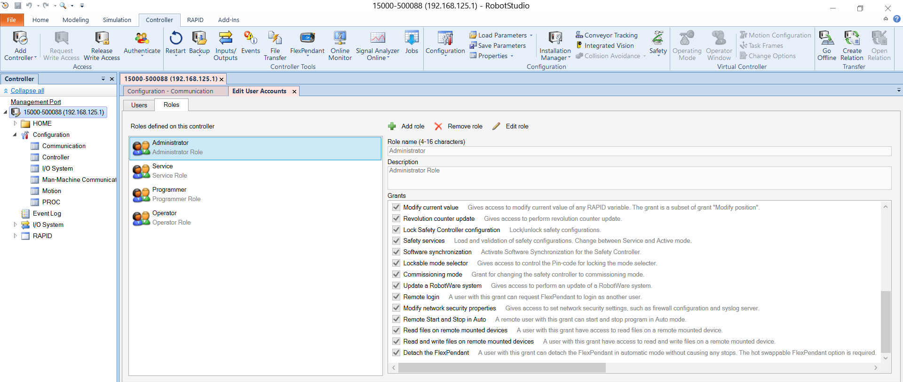

4. Apply.

Any other user can be used by passing the name and the password to **rws_interface**.

 
### Set up Config File and launch your abb robot (e.g. Gofa) 
Navigate to abb_driver/config/gofa_cfg.yaml
Modify the parameters based on your robot configuration (e.g. ip_robot, name_robot,task_robot, etc.)
Finally 
```bash
$ roslaunch abb_driver interface_gofa.launch
```
